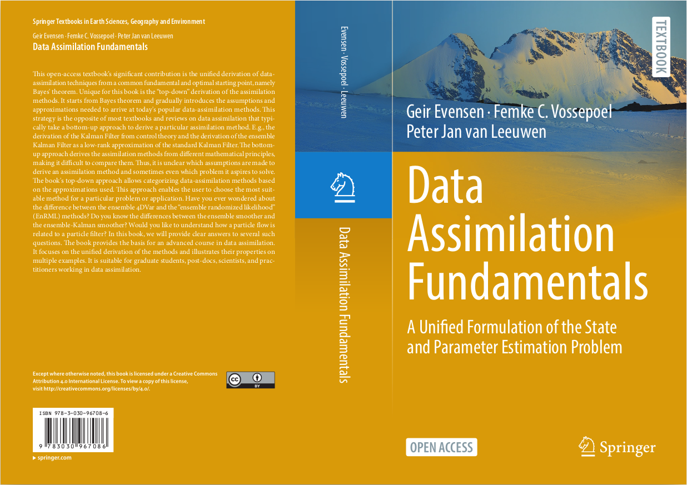

# Data-Assimilation-Fundamentals

This repository is a resource complementary to the Springer book: Data Assimilation Fundamental: A unified formulation for state and parameter estimation

The book is Open Access and is available from 
<a href="https://link.springer.com/book/10.1007/978-3-030-96709-3">https://link.springer.com/book/10.1007/978-3-030-96709-3</a>

Please rise an issue if you discover typos or errors in the book, or just wish to discuss one of the book's topics.

 

